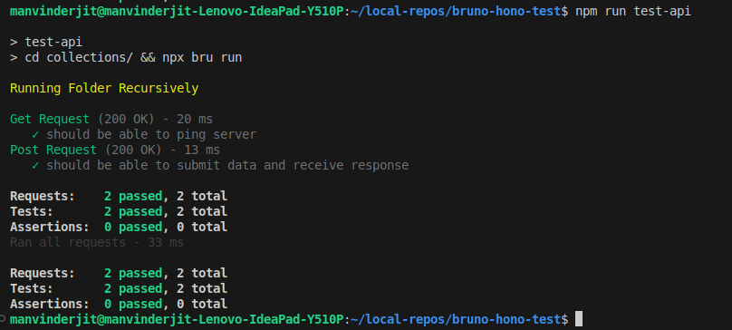
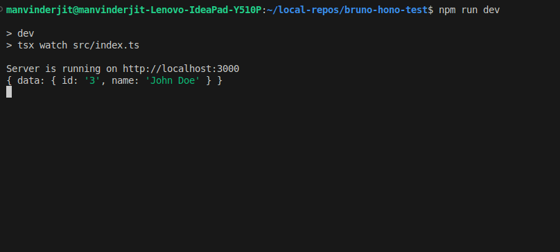

# Hono API Testing With Bruno
## 1. Installation Instructions
Navigate to the project folder and install dependencies

```
npm install
```
`It will install Bruno CLI as a dependency as well.`

## 2. Running Server

```
npm run dev
open http://localhost:3000 to verify
```

## 3. Bruno Api Testing Instructions
1. Make sure the server is running.
2. Open a new CLI window and run the following command:

```
npm run test-api
```
If you get the `connect ECONNREFUSED 127.0.0.1:3000` error, make sure the server is running before executing the api test command.

## Screenshots

#### API Tests
 

#### Running Server Output For Post Request
 