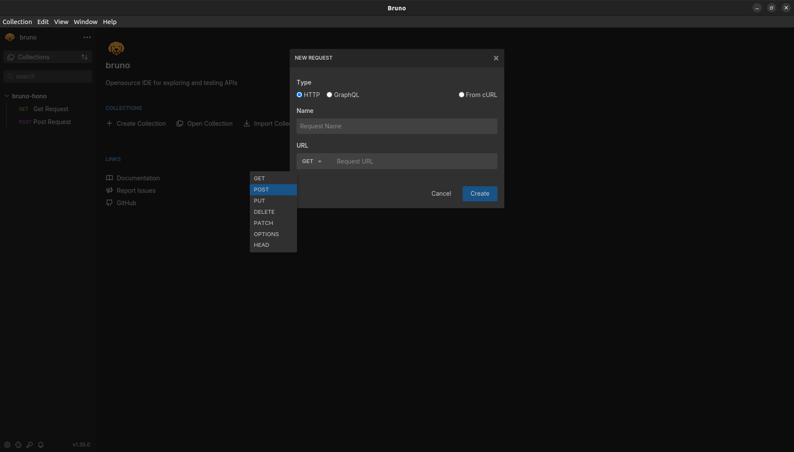

# Hono API Testing With Bruno
## 1. Installation Instructions
Navigate to the project folder and install dependencies

```
npm install
```
`It will install Bruno CLI as a dependency as well.`

## 2. Running Server

```
npm run dev
open http://localhost:3000 to verify
```

## 3. Bruno Api Testing Instructions
1. Make sure the server is running.
2. Open a new CLI window and run the following command:

```
npm run test-api
```
If you get the `connect ECONNREFUSED 127.0.0.1:3000` error, make sure the server is running before executing the api test command.

## Screenshots

#### API Tests
 

#### Running Server Output For Post Request


## 4. Running the Collection (API tests) in the Bruno desktop app
- a.) Download and install the Bruno desktop app from the [Bruno website](https://www.usebruno.com/downloads).
- b.) Open the Bruno app and click on the `Open Collection` link from the on-screen link or the drop-down menu.

    

- c.) In the pop-up, navigate to the `collections` folder of the cloned repo and select it. The collection should now be added.

    

- d.) Next, click the three dots `...` next to the collection `bruno-hono-test` to expand the drop-down menu and click on `Run`. It should open the collection runner. If it does not, check if you have may have clicked on the `Run` in the individual test's menu instead.

    

- e.) Ensure that the `app server is running` and then click on the `Run Collection` button to execute the API tests.

    

- f.) The collection should execute and show results.

    

## 5. Adding new tests to the collection via Bruno desktop

It is possible to add new tests to the collections locally via the Bruno desktop app. Follow the instructions for guidance:

- a.) Click the three dots `...` next to the collection `bruno-hono-test` to expand the drop-down menu and click on `New Request`.

    

- b.) Enter the details for the api to be tested including
    - Name for the API Request (any)
    - The request method (GET, POST, etc.)
    - The URL for the request

    and click on the `Create` button.

    

- c.) Add any other required data, like Params, Scripts, Assertions, Tests, etc. to the request.

    

    The request should be automatically added to the `collections` folder in the repository as well.

The new API test request can be run from either CLI or the Bruno app. 

### Sharing Collections

Collections can be shared among collborators by pushing them to GitHub along with the project repo or separately.

### Further Information

Check [Bruno Docs](https://docs.usebruno.com/introduction/what-is-bruno) for further information.